# AplusSurLeau

## Constat

- Le nautisme est trop peu démocratisé
- Les cercles sont très fermés et pas forcément bienveillants vis-à-vis des non-connaisseurs
- Ça coûte cher, ça peut faire peur, il y a une "barrière de verre" très importante qui empêche un plus grand nombre de gens de s'y mettre

## Description

**AplusSurLeau** c'est un algo qui permet d'accompagner le novice (qui ne part de rien et qui est persuadé que/ou qui ne s'est jamais posé la question et ça lui paraît loin) au cours des différentes étapes d'apprentissage.

**Objectif:**

- → Se poser les bonnes questions, au bon moment
- → Et savoir y répondre efficacement

---

## Moments clés du parcours

### M1 - Choix de l'activité
Choix de l'activité qui me conviendra (planche / wing / parawing / kite)

### M2 - Apprentissage
- Ai-je besoin de cours ? Combien ?
- Quand passer à la loc, surveillée ou non ?

### M3 - Acquisition du matériel
Quand acheter du matériel ? Et quoi ? Ça dépend de beaucoup de facteurs

---

## Fonctionnement du RAG-LLM

**AplusSurLeau** est un RAG-LLM qui permet de répondre précisément et de manière personnalisée aux questionnements des novices du nautisme.

### 1 - Poser les bonnes questions en fonction du contexte du pratiquant

Le système adapte ses questions selon:
- Le profil et le contexte du pratiquant (expérience, budget, disponibilité, localisation)
- Le moment du parcours (M1, M2, M3)
- Les spécificités individuelles (ressources, psychologie, caractéristiques physiques)

### 2 - Savoir y répondre en fonction de toutes les particularités qui vont émerger

En fonction des réponses et des éléments qui émergent:
- Spots (vague, température, vent, particularités)
- Ressources (budget, temps, disponibilité)
- Psychologie (sensations cherchées, peurs, motivations)
- Caractéristiques physiques (condition physique, sensibilité au froid, handicaps)
- Dangers et sécurité (reconnaissance des risques)
